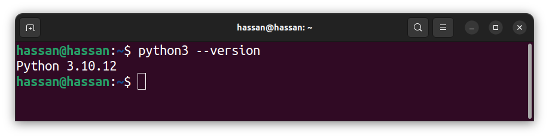
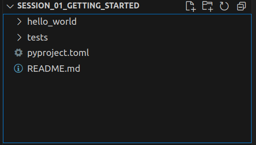

# Getting Started with Python and Poetry

## Installations

Welcome to the world of Python development with Poetry! Python is a powerful programming language widely used for web development, data analysis, artificial intelligence, and more. With Poetry, managing project dependencies and packaging becomes a breeze, allowing you to focus on writing clean and efficient code. This guide will walk you through the process of setting up Python and Poetry on your system, ensuring you have everything you need to start building Python projects with confidence.

1. **Download and Install Python 3**:

   Visit [python.org/downloads](https://www.python.org/downloads/) to download and install Python 3 on your system.

2. **Verify Python Installation**:

   After installing Python, open a terminal or command prompt and enter the following command:

   ```bash
   python --version
   ```

   If Python 2 is already installed on your system, please use `python3` instead of `python` in the command above. In some cases, especially on Windows, you may need to use `py` instead of `python`. Adjust accordingly based on your system. Upon successful execution, the installed Python version will be displayed.

   

   **Note**: In the future, continue using `python`, `python3`, or `py` according to your system's requirements.

3. **Verify pip Installation**:

   `pip` is a package installer for Python, which is typically installed along with Python by default. You can verify its installation by using the following command:

   ```bash
   pip --version
   ```

   Depending on your system configuration, you may need to use `pip3` instead of `pip`. Upon successful execution, the installed pip version will be displayed.

   

   If pip is not installed, you can install it using one of the following commands based on your system, or refer to the guide at [https://pip.pypa.io/en/stable/installation/](https://pip.pypa.io/en/stable/installation/):

   - For Linux and macOS:

     ```bash
     python -m ensurepip --upgrade
     ```

   - For Windows:

     ```bash
     py -m ensurepip --upgrade
     ```

4. **Install pipx**:

   Pipx is a useful tool designed to facilitate the installation and execution of Python applications within isolated environments, ensuring they don't interfere with your system's Python packages. To install `pipx`, execute the following command:

   ```bash
   python -m pip install --user pipx
   ```

   Once the installation is completed, ensure that pipx's binary directory is included in your system's PATH by running the following command:

   ```bash
   python -m pipx ensurepath
   ```

   Don't forget to restart the terminal to apply the PATH update. Verify the installation by entering the following command:

   ```bash
   pipx --version
   ```

   Upon successful execution, the installed `pipx` version will be displayed.

   

5. **Install Poetry**:

   Poetry is a dependency management and packaging tool for Python projects. To install `poetry`, execute the following command:

   ```bash
   pipx install poetry
   ```

   Verify the installation by entering the following command:

   ```bash
   poetry --version
   ```

   Upon successful execution, the installed `poetry` version will be displayed.

   

You've successfully installed Python along with Poetry, empowering yourself with the tools needed for efficient Python development. Whether you're a seasoned developer or just getting started, Poetry's dependency management capabilities will streamline your workflow and make project maintenance a breeze. Now that you're all set up, dive into the world of Python development, unleash your creativity, and build amazing projects!

## Project Setup using Poetry

Embarking on a new Python project journey with Poetry is an exciting endeavor! Poetry simplifies dependency management and project setup, allowing you to focus on coding without worrying about package conflicts. This guide will walk you through the essential steps to set up your Python project using Poetry, from creating the project structure to running your first Python code.

1. **Create a new project with Poetry**

   To initiate a new project using Poetry, execute the following command:

   ```bash
   poetry new my-python-project --name mypackage
   ```

   Replace `my-python-project` and `mypackage` with your preferred project and package names, respectively.

   

2. **Project Structure**

   After creating the project, the directory structure will resemble the following:

   

   Before proceeding to write our first Python code, let's understand the project structure:

   - `hello_world`: This is the package we just created. All our code will be written in this folder.
   - `tests`: All the respective tests will be written in this folder.
   - `pyproject.toml`: This file contains project metadata and dependencies managed by Poetry.
   - `Readme.md`: This is the README file for your project, providing information about its usage and setup.

3. **Install Dependencies**

   Before proceeding further, navigate to the terminal within the newly created project directory and execute the following command to install the listed dependencies from the `pyproject.toml` file. This command will also create a virtual environment:

   ```bash
   poetry install
   ```

   

   Copy the environment path listed here as it will be used in the next step.

4. **Select Interpreter for VS Code**

   Press `Ctrl + Shift + P` and select `Python: Select Interpreter`. This will provide a list of available Python interpreters. Either select the recently created environment from the list or select `Enter interpreter path` and paste the copied path from the previous step.

5. **Write Your First Python Code**

   Create a `main.py` file in the package folder. For this project, it will be located in the `hello_world` folder.

   ```python
   print("Hello World!")
   ```

   This simple Python code will print "Hello World!" when executed.

6. **Run the Code**

   If you prefer, you can activate the Poetry shell using the following command:

   ```bash
   poetry shell
   ```

   This will activate the Python environment in the terminal. Using the Poetry shell provides a convenient way to manage project dependencies and run Python commands within an isolated environment. It ensures consistency and prevents conflicts with system-wide packages. However, it's optional; you can still run commands using `poetry run` without activating the shell.

   Next, run the program using the following command:

   ```bash
   poetry run python hello_world/main.py
   ```

   This command executes the Python script and displays the output.

   

You've now laid the foundation for your Python project using Poetry! With a well-structured project directory, installed dependencies, and your first Python code written, you're ready to dive deeper into development. Whether you're building a web application, data analysis tool, or anything in between, Poetry provides a solid foundation for managing dependencies and ensuring project consistency. Keep exploring, keep coding, and unleash the full potential of your Python projects!

## Use Jupyter notebook with poetry kernel

Enriching your Python project with the interactive capabilities of Jupyter Notebook opens up a world of possibilities for exploration, experimentation, and documentation. By integrating Jupyter Notebook with Poetry, the modern dependency management tool for Python projects, you can seamlessly manage project dependencies and virtual environments while leveraging the interactive computing environment of Jupyter. This guide will walk you through the steps to set up Jupyter Notebook with Poetry, empowering you to harness the full potential of interactive Python development.

1. **Install Jupyter Notebook**

   To enhance your project with Jupyter Notebook capabilities, you can install Jupyter Notebook as a dependency using Poetry:

   ```bash
   poetry add jupyter
   ```

   Poetry, a modern dependency management tool for Python projects, streamlines the process of managing project dependencies and virtual environments. By using Poetry, you can ensure consistent dependency versions across different environments and simplify the sharing and distribution of your project.

2. **Install ipykernel**

   To make the virtual environment available as a kernel in Jupyter Notebook, you need to install `ipykernel`. This can be done using the following command:

   ```bash
   poetry add ipykernel
   ```

   `ipykernel` is a package that provides the IPython kernel for Jupyter. It allows you to run Jupyter Notebooks with different Python environments, ensuring compatibility and flexibility in your project. Installing `ipykernel` ensures that you can use your Poetry-managed virtual environment as a kernel within Jupyter Notebook, enabling seamless integration between your project's dependencies and your interactive computing environment.

3. **Add Virtual Environment**

   To add the virtual environment as a Jupyter kernel, execute the following command:

   ```bash
   poetry run python -m ipykernel install --user --name=my-python-project
   ```

   Replace `my-python-project` with your project name.

   This command registers the virtual environment as a kernel in Jupyter Notebook, allowing you to use it within your notebooks.

4. **Select the Kernel in VS Code**

   To select the kernel for your Jupyter Notebook in VS Code, follow these steps:

   1. Create a Jupyter Notebook file `main.ipynb` in the same folder as your `main.py` file.
   2. Navigate to the kernel options in the top right corner of the notebook interface.
   3. Click on the kernel dropdown menu.
   4. Choose the kernel you created earlier, which should be named after your project. Please note that you might need to restart VS Code to see the newly added kernel in the list.

   Selecting the appropriate kernel ensures that your notebook runs within the specified virtual environment, allowing you to access the project's dependencies seamlessly.

5. **Start using Jupyter Notebook**

You've successfully integrated Jupyter Notebook with Poetry, unlocking a powerful combination of dependency management and interactive computing capabilities for your Python projects. With Jupyter Notebook at your fingertips, you can explore data, prototype algorithms, and document your code with ease. By leveraging the strengths of both Jupyter and Poetry, you're equipped to embark on a journey of creativity, exploration, and innovation in your Python development endeavors. Happy coding with Jupyter Notebook and Poetry! 🚀
